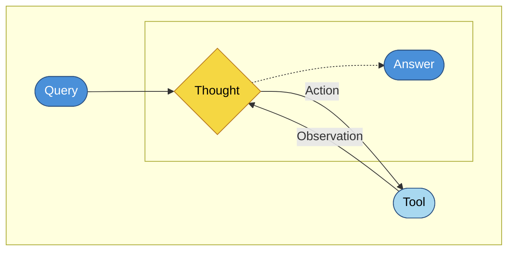

# Agent flow

ReAct-style loop: the model **thinks**, may **act** on a **tool**, receives an **observation**, and repeats until it can answer.

The dashed arrow from **Thought** to **Answer** is the path when the agent finishes without another tool call.
