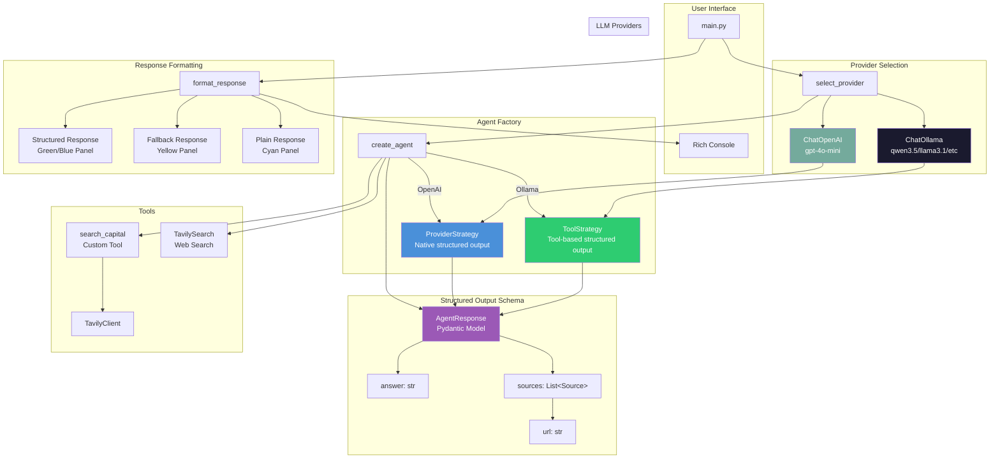
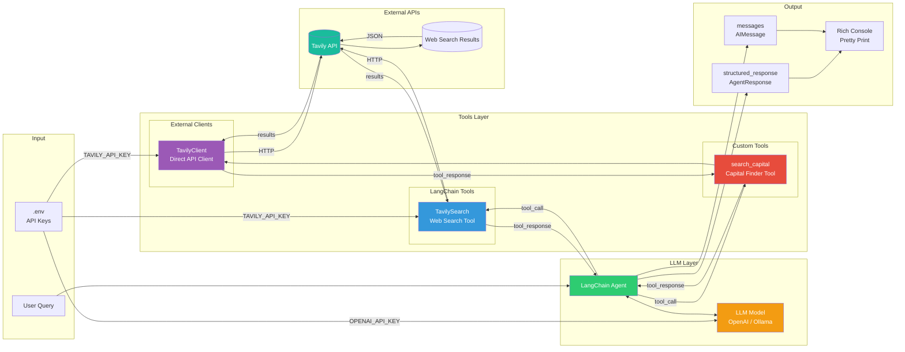
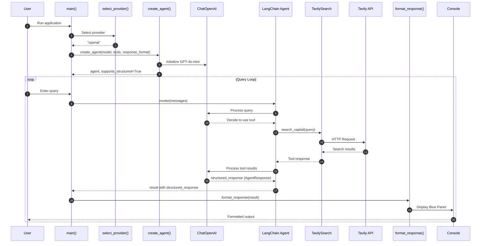
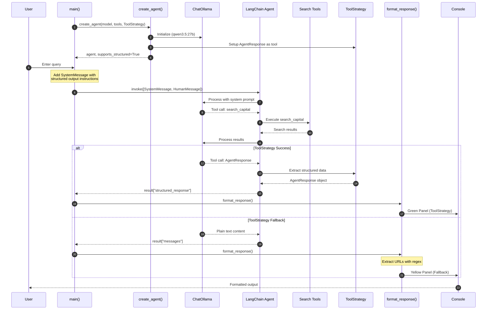
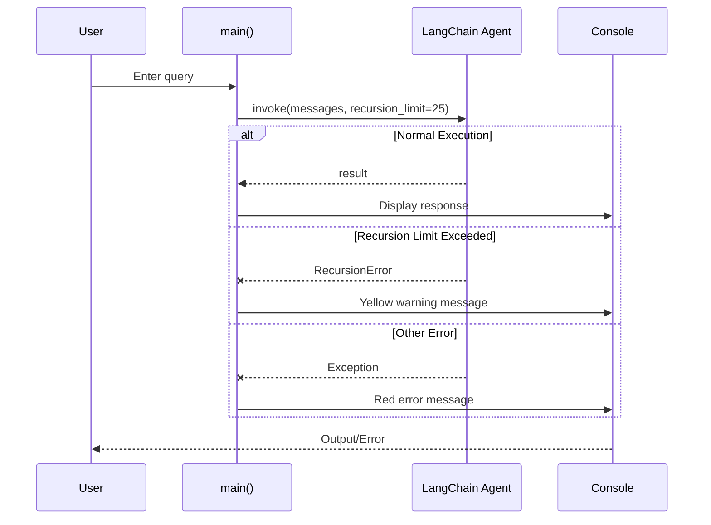
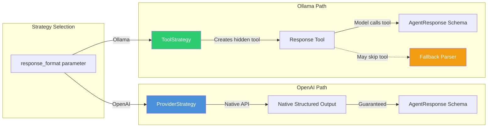

# LangChain Agent with Structured Output

A LangChain-based agent that supports both OpenAI and Ollama models with structured output capabilities using Pydantic schemas.

## Features

- **Multi-provider support**: OpenAI (GPT-4o-mini) and Ollama (local models)
- **Structured output**: Uses `ProviderStrategy` for OpenAI and `ToolStrategy` for Ollama
- **Web search tools**: Tavily Search integration
- **Pretty output**: Rich console formatting with JSON highlighting
- **Fallback handling**: Graceful degradation when ToolStrategy fails

## Architecture

### Component Diagram



### Data Flow Diagram



## Sequence Diagram

### Main Flow - OpenAI with ProviderStrategy



### Ollama with ToolStrategy Flow



### Error Handling Flow



## Structured Output Strategies



## Configuration

| Parameter | Value | Description |
|-----------|-------|-------------|
| `RECURSION_LIMIT` | 25 | Maximum agent graph depth |
| `MAX_ITERATIONS` | 10 | Reference for max tool calls |
| Temperature | 0.0 | Deterministic responses |

## Supported Models

| Model | Provider | ToolStrategy | Notes |
|-------|----------|--------------|-------|
| gpt-4o-mini | OpenAI | N/A (uses ProviderStrategy) | Best structured output |
| gpt-oss:latest | Ollama | ✅ | Local, tools capable |
| qwen3.5:27b | Ollama | ✅ | Best for agents |
| qwen3:8b | Ollama | ✅ | Good balance |
| llama3.1:8b | Ollama | ✅ | Reliable |
| gemma3:12b | Ollama | ⚠️ | Limited tool support |

## Usage

```bash
# Install dependencies
uv sync

# Run the application
python main.py
```

## Environment Variables

Create a `.env` file with:

```env
OPENAI_API_KEY=your_openai_key
TAVILY_API_KEY=your_tavily_key
```
